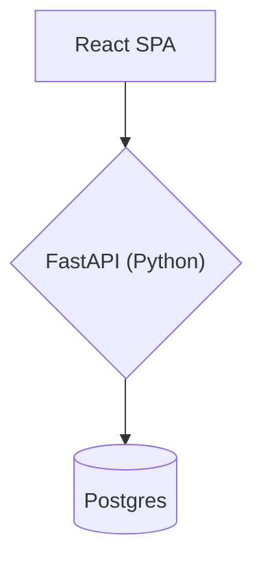
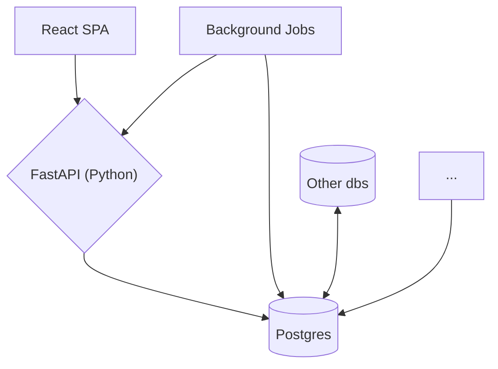

---
defaults:
  transition: slide-left
title: 'Seamless Transitions: Lessons from a Data Migration for a Mission-Critical App'
mdc: true
drawings:
  persist: true
---

# Seemless Transitions
## Lessons from a Data Migration for a Mission-Critical App{.opacity-70}

<div class="mt-5">
<span class="opacity-70">by Ryan Clements, Owner of </span><span class="accent">Byte Bot</span> 🤖
</div>


---
layout: image
image: kkr-logo.png
---

<!--
Who knows who KKR is?
-->

---
layout: image
image: kkr-aum.png
backgroundSize: contain
---

<!--
They manage tons of investments, many in commercial real estate

You probably drove by a few of the properties they own or loaned to on the way to this talk
-->

---
layout: center
---

# RealHouse

---
layout: center
---

# RealHouse

<div>

<v-clicks>

🔬 Internal data science tool providing in depth analysis to 1000+ investments

💪 Enhances KKR's real estate investment capabilities and getting better every sprint

👩‍💼 Supports 200+ employees across various departments

🚀 Key features

</v-clicks>

</div>

<!--
https://www.merlinsnotes.com/p/openai-nabs-largest-venture-round-ever
-->

---
layout: center
---

# Key features

<div>

<v-clicks>

📈 Instant access to deal information and metrics

⚙️ Automates routine tasks like monitoring interest rate caps

📊 Surfaces fund composition and risk exposures in one place

</v-clicks>

</div>

<!--
https://www.merlinsnotes.com/p/openai-nabs-largest-venture-round-ever
-->

---
layout: center
---



---
layout: center
---



---
layout: center
---

# <span class="tag">Problem:</span> We want to automate document tracking

---
layout: image-right
image: headshot.jpg
---

# Who am I?

<div>Ryan Clements, Owner of <span class="text-yellow-400">Byte Bot</span> 🤖</div>

<v-clicks>

<span class="muted">a software agency that helps software teams ship valuable software 🚀</span>

<div class="flex gap-2 mt-10">
  
  
  
  
  
  
  
</div>

<div class="flex flex-col gap-2 mt-10">

<div>🌐 bytebot.io</div>
<div>📧 info@bytebot.io</div>
<div>🐤 @RyanClementsHax</div>
<div>📥 bytebot.beehiiv.com/subscribe</div>

</div>

</v-clicks>

---
layout: center
---

# Goals

<div>

<v-clicks>

🔍 Learn how to <span class="clip">identify</span> the need for a data migration

💭 Learn how to <span class="clip">plan</span> a data migration

🏎️ Learn how to <span class="clip">execute</span> a data migration

😬 Learn how a data migration can <span class="clip">fail</span>

📖 <span class="clip">Share</span> a story

</v-clicks>

</div>

---
layout: image
image: sponsor.jpg
backgroundSize: contain
---

<!--
Sponsors are responsible for finding, financing, managing, and executing property investment projects to generate returns for investors

Could be multiple
-->

---
layout: image
image: borrower.webp
backgroundSize: contain
---

<!--
A borrower is the person or entity that takes out a loan to finance a property or project, agreeing to repay it with interest

Typically only one
-->

---
layout: image
image: guarantor.jpg
backgroundSize: contain
---

<!--
A guarantor in commercial real estate agrees to repay a loan or cover financial obligations if the primary borrower defaults

Could be multiple
-->

---
layout: center
---

# Let's see how we model the data

---
layout: center
---

# Take our <span class="tag">`loans`</span> table

```sql
CREATE TABLE loans (
    id UUID PRIMARY KEY DEFAULT uuid_generate_v4(),
    guarantor TEXT, -- arbitrary text
    -- a ton of other fields...
);
```

---
layout: center
---

# Example data

- Meridian Capital Advisors
- Oakridge Asset Holdings, Zenith Equity Management, Atlas Property Holdings
- Redwood Holdings & Co. & NorthStar Investment Trust
- (a) Fortress Capital Advisors (b) Endeavor Capital Ventures (c) John Doe
- Atlas Property Holdings; BlueRock Investment Solutions (Pledge)

---
layout: center
---

# Example data

- Meridian Capital Advisors
- Oakridge Asset Holdings<span class="clip">,</span> Zenith Equity Management<span class="clip">,</span> Atlas Property Holdings
- Redwood Holdings & Co. <span class="clip">&</span> NorthStar Investment Trust
- <span class="clip">(a)</span> Fortress Capital Advisors <span class="clip">(b)</span> Endeavor Capital Ventures <span class="clip">(c)</span> John Doe
- Atlas Property Holdings<span class="clip">;</span> BlueRock Investment Solutions (Pledge)

---
layout: center
---

<h1 class="no-clip !text-[100px]">😬</h1>

---
layout: center
---

# Why is this an issue?

```sql
CREATE TABLE loans (
    id UUID PRIMARY KEY DEFAULT uuid_generate_v4(),
    guarantor TEXT,
    -- ...
);
```

<!--
No id means no way to reliably assign documents to guarantors
-->

---
layout: center
---

# What we really wanted

```sql
CREATE TABLE loans (
    id UUID PRIMARY KEY DEFAULT uuid_generate_v4(),
    -- ...
);
CREATE TABLE guarantors (
    id UUID PRIMARY KEY DEFAULT uuid_generate_v4(),
    name TEXT,
    loan_id UUID REFERENCES loans(id)
);
```

---
layout: center
---

# First, we explored other solutions

---
layout: center
---

```py
uuid.uuid5(loan.id, "guarantor-1")
```

<!--
What happens if you edit the guarantor name or remove a guarantor?
-->

---
layout: center
---

<h1 class="no-clip !text-[100px]">🤷‍♂️</h1>

<!--
What if we didn't do the work at all?
-->

---
layout: image
image: spongebob-write.gif
---

---
layout: center
---

# Key parts of the alignment document

- What is the context?
- What needs to change?
- What do we gain from this?
- What could we be doing instead?
- What other options are there?
- What are their tradeoffs?
- What committments does this need?

---
layout: image
image: round-table.jpg
---

<!--
We gathered product, lead engineers, and domain experts to align on the next steps
-->

---
layout: center
---

<h1 class="no-clip !text-[100px]">👍</h1>

---
layout: center
---

# Time to plan

---
layout: center
---

# Migration strategies

<div>

<v-clicks>

💥 Big bang

✌️ Parallel or dual writes

🎂 Phased or incremental

🔍 Copy and verify

🛞 Rolling

🟦 Blue green deployments

👻 Shadow migration

📨 Event driven

</v-clicks>

</div>
<!--
- Big Bang migration
  - Migrate the entire database in a single operation, usually during a scheduled downtime.
  - Pros:
    - Simpler to plan and execute in terms of logistics.
    - Requires less time overall since changes are implemented in one go.
  - Cons:
    - Risky if something goes wrong; rollback can be complex.
    - Requires significant downtime, which may not be feasible for 24/7 applications.
    - Harder to troubleshoot issues due to the sheer number of changes.
- Parallel or Dual Writes
  - Write to both old and new databases simultaneously to keep them synchronized before switching over.
  - Pros:
    - Reduces downtime as the system can stay live during the migration.
    - Provides an opportunity to validate data in the new database before cutover.
  - Cons:
    - More complex to implement, especially when dealing with conflicting data models.
    - Increased operational overhead since all writes need to be managed and monitored in two systems.
- Phased or Incremental Migration
  - Migrate portions of the database over time, reducing the scope of each migration and avoiding full-system downtime.
  - Pros:
    - Reduces risk by breaking the migration into smaller, manageable steps.
    - Allows for partial rollbacks if issues arise in a specific phase.
  - Cons:
    - Takes longer to complete the full migration.
    - Can introduce complexity in ensuring data consistency across systems.
- Copy and Verify
  - Copy data to the new database, then verify and validate before making the switch.
  - Pros:
    - Reduced risk as data integrity and performance can be thoroughly checked in the new system.
    - Allows for a trial phase to test the new environment without affecting the old system.
  - Cons:
    - Requires additional resources for verification, which can delay the migration.
    - More complex to handle real-time data as you need to re-sync if there’s a lag in cutover.
- Rolling Migration
  - Gradually migrate data by diverting a small portion of traffic or users to the new database.
  - Pros:
    - Minimizes impact by limiting exposure if any issues arise.
    - Allows for real-world testing with actual user traffic in smaller volumes.
  - Cons:
    - Requires load balancing to split traffic between old and new systems.
    - Can be hard to manage if there are significant data model changes between old and new.
- Blue-Green Deployment for Database Migrations
  - Run two identical environments (old and new databases) and switch traffic to the new database once it’s ready.
  - Pros:
    - Reduces downtime as traffic can be switched instantly.
    - Allows for easy rollback if issues occur with the new database.
  - Cons:
    - Requires double the infrastructure resources during the migration period.
    - More complex to handle if you need real-time synchronization between blue and green environments.
- Shadow Migration
  - Migrate data to the new database without switching traffic, allowing for testing and validation before cutover.
  - Pros:
    - Provides time to fully test the new database with production-like data.
    - No impact on users during migration, as it happens in the background.
  - Cons:
    - Requires continuous synchronization and extra storage.
    - Extended testing phase can add to the overall migration time.
- Event-Driven Migration
  - Use events (like a change data capture system) to migrate data as it changes.
  - Pros:
    - Ensures that the latest data is always migrated, reducing the risk of stale data.
    - Can work well with microservices or event-driven architectures.
  - Cons:
    - Requires significant changes to data handling if the system wasn’t originally event-driven.
    - Adds complexity in terms of managing event logs and ensuring idempotency.
-->

---
layout: center
---

# Which one do we use?

---
layout: center
---

# Know your application!

<!--
If you have a headache, what is a good medicine for it?

What if that headache was caused by liver issues?
What if that headache was a rebound headache caused by taking too much Tylenol?
What if that headache was actually caused by sinus blockage?
-->

---
layout: center
---

# Properties of this application

<div>

<v-clicks>

🔒 Internal app with controlled user access

🕒 Users clocked out at the end of the week, allowing for downtime

📉 Low-traffic features, reducing complexity during the migration

🤏 Limited data size, allowing manual verification

</v-clicks>

</div>

---
layout: center
---

# Impacted features

<div>

<v-clicks>

💻 Excel onboarding

🧮 Needed full CRUD over guarantors

🧥 Foreign Data Wrapper (FDW)

📩 Reporting export

</v-clicks>

</div>

---
layout: center
---

# What do you think?

---
layout: center
---

# We went with big bang <span class="no-clip">💥</span> (but technically phased)

<!--
We could afford down time
We made users pinky promise not to modify guarantor information during a certain window
-->

---
layout: image
image: spongebob-write.gif
---

---
layout: center
---

# What goes into this document?

<div>

<v-clicks>

- Why you're doing it
- What it buys you
- What features are impacted
- What is the data (don't assume people know)
- What needs to be changed and by whom?
- What dependencies are there?
- How will the actual migration happen?
- When will we do this?
- What steps does it need to happen in?
- Are there any dependencies to deployment?
- How will you verify it? (Cannot stress how important this is)

</v-clicks>

</div>

<!--
Most of the time was spent here

Frontloading projects into a documentation helps so much

It made the actual tasks feel "pure implementation"
-->

---
layout: center
---

# We got everything done in a sprint and there weren't any issues

---
layout: center
---

<h1 class="no-clip !text-[100px]">🙈🙉🙊</h1>

---
layout: center
---

<h1 class="no-clip !text-[100px]">🐲</h1>

---
layout: center
---

# The dragons

<div>

<v-clicks>

❌ Making schema changes wasn't well documented eating a lot of time

❌ Few people knew how the FDW worked or how to develop/test changes to it

❌ And one other one...

</v-clicks>

</div>

---
layout: image
image: dun-dun-dun.gif
backgroundSize: contain
---

---
layout: image
image: excel-logo.png
backgroundSize: contain
---

<!--
We came up to a day or two before the release and the excel process wasn't converted

Turns out there were tons of edge cases and no one fully understood how this worked

We mobbed it and turns out our python library doesn't support the obvious way of validating in excel

It delayed the migration, but not in a significant way
-->

---
layout: center
---

<h1 class="no-clip !text-[100px]">🚀</h1>

---
layout: center
---

# Key take aways

<div>

<v-clicks>

👩‍💼 Understand your application and users

💊 Choose the right medicine

💪 Most of the effort goes into the nontech parts

🗣️ You can't overcommunicate

💥 Expect there to be bumps, and the only way to find all of them is to actually do the work
  
🙈 Even the directly responsible engineers don't always fully understand the system

</v-clicks>

</div>

---
layout: center
---

# <span class="no-clip">🤔</span> Got questions?

---
layout: image-left
image: linktree-qr.png
backgroundSize: contain
---

# Here's how we can stay in touch

<div class="flex flex-col gap-5 text-2xl mt-5">

<div>🌐 bytebot.io</div>
<div>📧 info@bytebot.io</div>
<div>🐤 @RyanClementsHax</div>
<div>📥 bytebot.beehiiv.com/subscribe</div>

</div>
