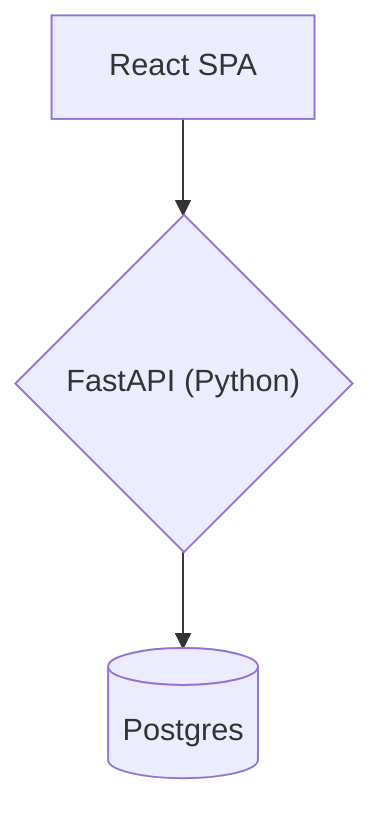
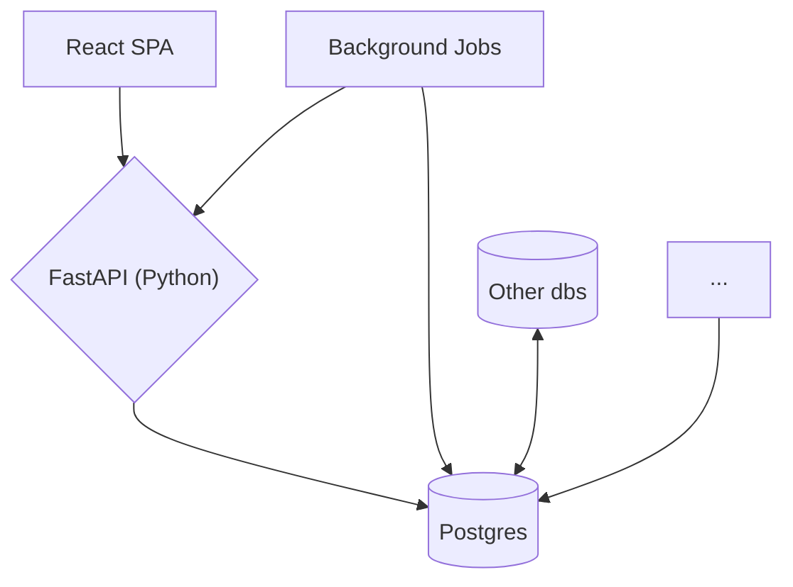

---
defaults:
  transition: slide-left
title: 'Seamless Transitions: Lessons from a Data Migration for a Mission-Critical App'
mdc: true
drawings:
  persist: true
---

# Seemless Transitions
## Lessons from a Data Migration for a Mission-Critical App{.opacity-70}

by Ryan Clements, Owner of Byte Bot 🤖

---
layout: image
image: kkr-logo.png
---

<!--
Who knows who KKR is?
-->

---
layout: image
image: kkr-aum.png
backgroundSize: contain
---

<!--
They manage tons of investments, many in commercial real estate

You probably drove by a few of the properties they own or loaned to on the way to this talk
-->

---
layout: center
---

# RealHouse

---
layout: center
---

# RealHouse

<v-clicks>

🔬 Internal data science tool providing in depth analysis to 1000+ investments

💪 Enhances KKR's real estate investment capabilities and getting better every sprint

👩‍💼 Supports 200+ employees across various departments

🚀 Key features

</v-clicks>

<!--
https://www.merlinsnotes.com/p/openai-nabs-largest-venture-round-ever
-->

---
layout: center
---

# Key features

<v-clicks>

📈 Instant access to deal information and metrics

⚙️ Automates routine tasks like monitoring interest rate caps

📊 Surfaces fund composition and risk exposures in one place

</v-clicks>

<!--
https://www.merlinsnotes.com/p/openai-nabs-largest-venture-round-ever
-->

---
layout: center
---

---
layout: center
---

---

- Problem: We want to track documents

---
layout: image-right
image: headshot.jpg
---

# Who am I?

Ryan Clements, Owner of Byte Bot 🤖

<v-clicks>

a software agency that helps software teams ship valuable software 🚀

  
  
  
  
  
  
  

🌐 bytebot.io

📧 info@bytebot.io

🐤 @RyanClementsHax

📥 bytebot.beehiiv.com/subscribe

</v-clicks>

---

- Goals of talk
- Outline of problem domain (guarantors, etc)
- Uh oh: our data model isn't sufficient
- Outline what we wanted
- Finding any other solution first
- Drafting document and getting alignment
- Time to plan now
- Different migration strategies
  - Big Bang migration
    - Migrate the entire database in a single operation, usually during a scheduled downtime.
    - Pros:
      - Simpler to plan and execute in terms of logistics.
      - Requires less time overall since changes are implemented in one go.
    - Cons:
      - Risky if something goes wrong; rollback can be complex.
      - Requires significant downtime, which may not be feasible for 24/7 applications.
      - Harder to troubleshoot issues due to the sheer number of changes.
  - Parallel or Dual Writes
    - Write to both old and new databases simultaneously to keep them synchronized before switching over.
    - Pros:
      - Reduces downtime as the system can stay live during the migration.
      - Provides an opportunity to validate data in the new database before cutover.
    - Cons:
      - More complex to implement, especially when dealing with conflicting data models.
      - Increased operational overhead since all writes need to be managed and monitored in two systems.
  - Phased or Incremental Migration
    - Migrate portions of the database over time, reducing the scope of each migration and avoiding full-system downtime.
    - Pros:
      - Reduces risk by breaking the migration into smaller, manageable steps.
      - Allows for partial rollbacks if issues arise in a specific phase.
    - Cons:
      - Takes longer to complete the full migration.
      - Can introduce complexity in ensuring data consistency across systems.
  - Copy and Verify
    - Copy data to the new database, then verify and validate before making the switch.
    - Pros:
      - Reduced risk as data integrity and performance can be thoroughly checked in the new system.
      - Allows for a trial phase to test the new environment without affecting the old system.
    - Cons:
      - Requires additional resources for verification, which can delay the migration.
      - More complex to handle real-time data as you need to re-sync if there’s a lag in cutover.
  - Rolling Migration
    - Gradually migrate data by diverting a small portion of traffic or users to the new database.
    - Pros:
      - Minimizes impact by limiting exposure if any issues arise.
      - Allows for real-world testing with actual user traffic in smaller volumes.
    - Cons:
      - Requires load balancing to split traffic between old and new systems.
      - Can be hard to manage if there are significant data model changes between old and new.
  - Blue-Green Deployment for Database Migrations
    - Run two identical environments (old and new databases) and switch traffic to the new database once it’s ready.
    - Pros:
      - Reduces downtime as traffic can be switched instantly.
      - Allows for easy rollback if issues occur with the new database.
    - Cons:
      - Requires double the infrastructure resources during the migration period.
      - More complex to handle if you need real-time synchronization between blue and green environments.
  - Shadow Migration
    - Migrate data to the new database without switching traffic, allowing for testing and validation before cutover.
    - Pros:
      - Provides time to fully test the new database with production-like data.
      - No impact on users during migration, as it happens in the background.
    - Cons:
      - Requires continuous synchronization and extra storage.
      - Extended testing phase can add to the overall migration time.
  - Event-Driven Migration
    - Use events (like a change data capture system) to migrate data as it changes.
    - Pros:
      - Ensures that the latest data is always migrated, reducing the risk of stale data.
      - Can work well with microservices or event-driven architectures.
    - Cons:
      - Requires significant changes to data handling if the system wasn’t originally event-driven.
      - Adds complexity in terms of managing event logs and ensuring idempotency.
- How do we know which one to use?
- Know your application
- Analogy with treating wrong headache with tylenol
- Properties of the application
  - Internal app with controlled user access
  - Users clocked out at the end of the week, allowing for downtime
  - Low-traffic features, reducing complexity during the migration
  - Limited data size, allowing manual verification
- Relevant application features impacted
  - Excel onboarding
  - Needed full CRUD over guarantors
  - FDW
  - Reporting export
- What do you think?
- We went with big bang + down time, with pinky promising from the users
- Documentation is key
  - Buy in
  - Communication
  - Calling out areas we need alignment
  - Spent the most time here
  - Frontloading projects into a documentation helps so much
- Things you need to consider
  - Why you're doing it
  - What it buys you
  - What features are impacted
  - What is the data (don't assume people know)
  - What needs to be changed and by whom?
  - What dependencies are there?
  - How will the actual migration happen?
  - When will we do this?
  - How will you verify it?
  - What steps does it need to happen in?
  - Are there any dependencies to deployment?
- Task delegation was super easy once everything was written up
- Most everything was super easy to develop especially since there was an established way of verifying the migration's correctness
- Thar be dragons
- Making schema changes wasn't well documented eating a lot of time
- Few people knew how the FDW worked or how to develop/test changes to it
- Dun dun dun
- We came up to a day or two before the release and the excel process wasn't converted
- Turns out there were tons of edge cases and no one fully understood how this worked
- We mobbed it and turns out our python library doesn't support the obvious way of validating in excel
- It delayed the migration, but not in a significant way
- Aside from that we deployed.......and no other issues were faced
- Key take aways
  - Understand your application and users
  - Choose the right medicine
  - Most of the effort goes into the nontech parts
  - You can't overcommunicate
  - Expect there to be bumps, and the only way to find all of them is to actually do the work
  - Even the directly responsible engineers don't always fully understand the system
