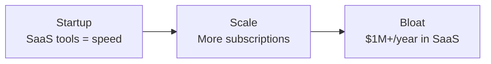
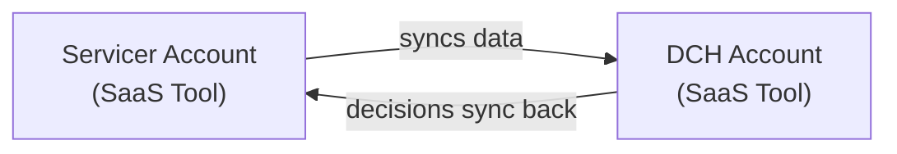
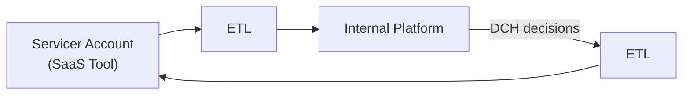

---
defaults:
  transition: slide-left
title: 'The $600K ETL: How We Cancelled a Contract by Building Less'
mdc: true
drawings:
  persist: true
---

# How We Deleted $600K in Software Costs

## And What We Learned Along the Way{.opacity-70}

<div class="mt-5">
<span class="opacity-70">by Ryan Clements, Owner of </span><span class="accent">Byte Bot</span>
</div>

---
layout: center
---

# A business with a deadline doesn't care about your architecture... <span v-click>It only cares that you deliver lasting results.</span>

---
layout: center
---

# Goals

<div>

<v-clicks>

📖 Share a <span class="clip">war story</span> about replacing a $600K/year vendor

🎯 Learn how to <span class="clip">hyperfocus</span> on driving tangible results

📝 Learn <span class="clip">effective</span> technical design and project management techniques

🤝 Learn how to <span class="clip">manage</span> disincentivized vendors

🛠️ Learn practical <span class="clip">design principles</span> for ETL pipelines

🧠 Learn how to <span class="clip">leverage</span> constraints for better outcomes

</v-clicks>

</div>

---
layout: image-right
image: headshot.jpg
---

# Who am I?

<div>RC Clements, Owner of <span class="accent">Byte Bot</span></div>

<v-clicks>

<span class="muted">a full-stack software agency that helps software teams ship valuable software</span>

<div class="flex gap-2 mt-10">
  
  
  
  
  
  
  
  
</div>

<div class="flex flex-col gap-2 mt-10">
<div>🌐 bytebot.io</div>
<div>📧 info@bytebot.io</div>
<div>🐤 @RyanClementsHax</div>
<div>📥 bytebot.beehiiv.com/subscribe</div>
</div>

</v-clicks>

---
layout: center
---

TODO: picture of raising hands

<!--
- "Raise your hand if you've ever paid for a gym membership you didn't use."
- "Now keep your hand up if you've ever seen a company pay $50,000 a month for software features they never touched."
-->

---
layout: center
---

# The Client's Origin Story

<div>

<v-clicks>

🏢 Scrappy start

🚀 Launched fast with off the shelf tools

⚡ Getting rated as a loan servicer was **existential**

</v-clicks>

</div>

<!--
- Commercial loan servicer that started scrappy using off-the-shelf SaaS tools
- Getting rated quickly was existential for them — their viability as a business depended on it
- They made the right decision at the time. SaaS tools got them to market fast without building infrastructure
- Emphasize: this was the RIGHT call at the time. No regrets.
-->

---
layout: center
---

# Startup → Scale → Bloat



<!--
Now they've had several years of stable growth, they're dealing with bloat
-->

---
layout: center
---

# The <span class="text-green-500">$1M</span> Problem

<div>

<v-clicks>

💸 **$1M+/year** in subscriptions to just one vendor

📊 Using maybe **20%** of features

🤷‍♂️ Sorta worked

🔒 Locked into contracts

🤔 Major opportunity cost

</v-clicks>

</div>

<!--
- As they scaled, subscriptions ballooned to over $1M/year
- They were using maybe 20% of the features they were paying for
- The tools didn't give them the data analysis they actually needed
- Classic enterprise trap: locked into contracts, paying for optionality they never exercise
-->

---
layout: center
clicks: 9
---

# The Specific Pain Point

<div class="flex items-center justify-center gap-3 mt-10 text-lg relative">

<div class="border border-blue-500/50 rounded-lg px-3 py-2 bg-blue-900/40 text-center w-32 h-14 flex items-center justify-center">
<div class="font-bold text-sm">Servicer</div>
</div>

<div class="text-xl w-8 text-center">→</div>

<div class="border border-red-500/50 rounded-xl p-3 bg-red-900/10">
<div class="text-xs uppercase tracking-wider text-red-400 text-center mb-2">Expensive SaaS Tool</div>
<div class="flex items-center gap-3">
<div class="border border-blue-500/50 rounded-lg px-3 py-2 bg-blue-900/40 text-center w-32 h-14 flex items-center justify-center">
<div class="font-bold text-sm">Servicer Acct</div>
</div>
<div class="text-sm opacity-50 w-8 text-center">→</div>
<div class="border border-red-500/50 rounded-lg px-3 py-2 bg-red-900/40 text-center w-32 h-14 flex flex-col items-center justify-center">
<div class="font-bold text-sm">Parent Co Acct</div>
<div class="text-xs text-red-400">$50K/mo</div>
</div>
</div>
</div>

<div class="text-xl w-8 text-center">→</div>

<div class="border border-blue-500/50 rounded-lg px-3 py-2 bg-blue-900/40 text-center w-32 h-14 flex items-center justify-center">
<div class="font-bold text-sm">DCH Parent Co</div>
</div>

<div
  v-click="[1, 5]" v-motion
  :initial="{ x: -288 }"
  :enter="{ x: -288 }"
  :click-2="{ x: -96 }"
  :click-3="{ x: 96 }"
  :click-4="{ x: 288 }"
  :leave="{ x: 288 }"
  class="absolute -bottom-8 left-0 right-0 flex justify-center"
><span class="text-2xl">📜</span><span class="text-2xl -ml-3">📜</span><span class="text-2xl -ml-3">📜</span></div>

<div
  v-click="5" v-motion
  :initial="{ x: 288 }"
  :enter="{ x: 288 }"
  :click-6="{ x: 96 }"
  :click-7="{ x: -96 }"
  :click-8="{ x: -288 }"
  class="absolute -bottom-8 left-0 right-0 flex justify-center"
><span class="text-xl">✅</span><span class="text-xl -ml-1">✅</span><span class="text-xl -ml-1">❌</span></div>

</div>

<div v-click="9" class="mt-14 text-xl opacity-70 text-center">

One expensive SaaS contract for **one** workflow.

</div>

---
layout: center
---

# The Insight

<div v-click class="text-2xl mt-5">

This workflow didn't <span class="clip">need</span> to live in an external tool.

</div>

<div v-click class="text-2xl mt-3">

The parent company <span class="clip">developed an internal platform</span> since the servicer was founded.

</div>

<div v-click class="text-2xl mt-3">

It could be replicated <span class="clip">in-house</span>.

</div>

---
layout: center
---

# The Vision

<div class="flex items-center justify-center gap-3 mt-10 text-lg relative">

<div class="border border-blue-500/50 rounded-lg px-3 py-2 bg-blue-900/40 text-center w-32 h-14 flex items-center justify-center">
<div class="font-bold text-sm">Servicer</div>
</div>

<div class="text-xl w-8 text-center">→</div>

<div class="border border-red-500/50 rounded-xl p-3 bg-red-900/10">
<div class="text-xs uppercase tracking-wider text-red-400 text-center mb-2">Expensive SaaS Tool</div>
<div class="flex items-center justify-center">
<div class="border border-blue-500/50 rounded-lg px-3 py-2 bg-blue-900/40 text-center w-32 h-14 flex items-center justify-center">
<div class="font-bold text-sm">Servicer Acct</div>
</div>
</div>
</div>

<div class="text-xl w-8 text-center">→</div>

<div class="border border-green-500/50 rounded-xl p-3 bg-green-900/10">
<div class="text-xs uppercase tracking-wider text-green-400 text-center mb-2">Internal Platform</div>
<div class="flex items-center justify-center">
<div class="border border-green-500/50 rounded-lg px-3 py-2 bg-green-900/40 text-center w-32 h-14 flex flex-col items-center justify-center">
<div class="font-bold text-sm">Parent Co Acct</div>
<div class="text-xs text-green-400">~$0/mo</div>
</div>
</div>
</div>

<div class="text-xl w-8 text-center">→</div>

<div class="border border-blue-500/50 rounded-lg px-3 py-2 bg-blue-900/40 text-center w-32 h-14 flex items-center justify-center">
<div class="font-bold text-sm">DCH Parent Co</div>
</div>

<div
  v-click="[1, 5]" v-motion
  :initial="{ x: -312.5 }"
  :enter="{ x: -312.5 }"
  :click-2="{ x: -109 }"
  :click-3="{ x: 115 }"
  :click-4="{ x: 315 }"
  :leave="{ x: 315 }"
  class="absolute -bottom-10 left-0 right-0 flex justify-center"
><span class="text-2xl">📜</span><span class="text-2xl -ml-3">📜</span><span class="text-2xl -ml-3">📜</span></div>

<div
  v-click="5" v-motion
  :initial="{ x: 315 }"
  :enter="{ x: 315 }"
  :click-6="{ x: 115 }"
  :click-7="{ x: -109 }"
  :click-8="{ x: -312.5 }"
  class="absolute -bottom-10 left-0 right-0 flex justify-center"
><span class="text-xl">✅</span><span class="text-xl -ml-1">✅</span><span class="text-xl -ml-1">✅</span></div>

</div>

<div v-click="9" class="mt-14 text-xl opacity-70 text-center">

Same workflow, **replicated in-house** on the internal platform.

</div>

---
layout: center
---

# The Prize

<h2 class="!text-6xl mt-8">

<span class="clip">$50K/month = $600K/year</span>

</h2>

<div v-click class="mt-5 text-xl opacity-70">

Cancel one contract. Save $600K annually.

</div>

---
layout: center
---

# <span class="tag">Part 2:</span> The Conflict

## The Stakes

---
layout: center
---

# The Deadline

<h2 v-click class="!text-6xl mt-8">

4 months.

</h2>

<div v-click class="mt-8 text-3xl">

"Four months. Starting now."

</div>

<!--
- Enterprise contracts don't forgive missed deadlines
- We had 4 months to ship or eat the cost of another full year on the contract
- This wasn't a "nice to have" — it was a business imperative with a hard stop
- Let the "four months" land. Pause for effect.
-->

---
layout: center
---

# "There are known knowns..."

<div v-click class="mt-5 text-2xl">

"...and then there are the APIs you've never integrated with."

</div>

---
layout: center
---

# Two Major Risks

<div>

<v-clicks>

<div class="text-2xl mb-8">

**1. Poorly documented APIs**

</div>

<div class="text-2xl">

**2. A vendor with zero incentive to help**

</div>

</v-clicks>

</div>

<!--
- Risk 1: The SaaS provider's APIs were poorly documented. Sparse, outdated, or just wrong. No way to estimate effort accurately because we'd never integrated with them before.
- Risk 2: The vendor had zero incentive to help us. Think about it: we're calling them for help... so we can give them LESS money. Their engineering team's priority? Not us.
-->

---
layout: center
---

# "Who here has tried to get help from a vendor you're about to leave?"

<div v-click class="mt-5 text-2xl opacity-70">

Yeah.

</div>

<!--
Audience engagement moment — let this breathe.
-->

---
layout: center
---

# The Data Problem

<div>

<v-clicks>

🔀 Messy data flows

🆔 No clean IDs

🎨 "Creative" data quality

</v-clicks>

</div>

<div v-click class="mt-8 text-xl">

> "Don't trust. Verify. Then verify again."

</div>

<!--
- Before even touching code, we discovered the existing workflow was a mess of data flowing between two accounts
- No clean unique identifiers in their system
- Data quality was... "creative" — tell a short anecdote if time allows
- We couldn't trust what they told us about the data — we had to verify everything ourselves
-->

---
layout: center
---

# <span class="tag">Part 3:</span> The Journey

## Building It

---
layout: center
---

# Phase 1: Define Before You Build

---
layout: center
---

# The ABDiff Framework

<div class="text-2xl mt-5">

"Projects fail when teams assume alignment."

</div>

<div v-click class="text-2xl mt-3">

**Define A. Define B. Ship the diff.**

</div>

<div v-click class="mt-5 opacity-50 text-sm">

bytebot.io/blog/stop-assuming-alignment-start-proving-it

</div>

---
layout: center
---

# Point A — Current State



<div class="mt-5 opacity-70">

Manual processes • Poor visibility • Expensive

</div>

---
layout: center
---

# Point B — Target State



<div class="mt-5 opacity-70">

Cancel DCH account contract ✅

</div>

---
layout: center
---

# The Diff = The Backlog

<div>

<v-clicks>

🔎 Hidden integration points

❓ Specific vendor questions

🎯 Scope alignment

📋 Natural task breakdown

</v-clicks>

</div>

<!--
- The diff between A and B revealed integration points we hadn't considered
- It gave us specific questions to bring to the vendor instead of vague asks
- It aligned everyone on scope — no scope creep because the target was concrete
- It created a natural task breakdown — the backlog practically wrote itself
-->

---
layout: center
---

# Key Decisions

<div>

<v-clicks>

🛠️ **Simple tools**

🎯 **Cancel the contract** — nothing else

📌 **Sources of truth**

🔁 **Idempotency**

📝 **Logging over metrics**

</v-clicks>

</div>

<div v-click class="mt-8 text-xl">

> "Don't try to solve every problem. We stayed focused."

</div>

<!--
- Simple tools: Low-volume ETL meant no need for Kafka, Airflow, etc. Don't over-engineer.
- Cancel the contract: The goal was to cancel the contract, not fix bugs or improve the existing system. Don't add risk.
- Sources of truth: Define which system owns which data element. Handle sync failures gracefully.
- Idempotency: At-least-once delivery semantics. Handle duplicates gracefully.
- Logging over metrics: The team hadn't invested in metrics infrastructure yet. Meet them where they are.
-->

---
layout: center
---

# Phase 2: Managing the Disincentivized Vendor

---
layout: center
---

# The Communication Breakthrough

TODO: visual showing emails going into a void vs. a Teams channel lighting up — the "before and after" of communication

<div>

<v-clicks>

📧 → 🕳️

💬 → ✅

</v-clicks>

</div>

<!--
- Tell the story: Emails were going into a black hole. No responses, no progress.
- Then we realized they used Microsoft Teams — just like our client!
- Set up a shared Teams channel + weekly sync meeting
- Communication problems: solved overnight
- The point: sometimes the breakthrough isn't technical, it's finding the right communication channel
-->

---
layout: center
---

# The "Ball in Their Court" Strategy

<div class="text-xl mb-5">

> "They had zero incentive to meet our deadline. So we made sure they were never waiting on us."

</div>

<div>

<v-clicks>

⚡ Respond fast

🔮 Pre-answer questions

📝 Document everything

🔦 Make delays visible

</v-clicks>

</div>

<!--
- Respond to their requests within hours, not days — show urgency even if they don't
- Pre-answer questions they hadn't asked yet — anticipate and remove blockers before they arise
- Document everything in the shared channel — build the paper trail
- Make it obvious when delays were on their side
- Result: when escalation conversations happened, the paper trail was clear and we were never the bottleneck
-->

---
layout: center
---

# Security — Early

<div>

<v-clicks>

🔒 **Day one**

🔑 Access, SFTP, credentials

🏃 **Hit the ground running**

</v-clicks>

</div>

<!--
- Got the security team involved from day one — don't let this become a blocker later
- Access provisioning, SFTP setup, credential exchange — all the things that take weeks if you start late
- By the time engineering resources were available, we could hit the ground running
- Key point: security setup is a known long-lead-time item. Start it immediately.
-->

---
layout: center
---

# Phase 3: Building for Reality

---
layout: center
---

# "Their API took 15 minutes to respond."

<div v-click class="mt-5 text-xl opacity-70">

I wish I was joking.

</div>

<!--
Pause for audience reaction. Let the absurdity sink in.
-->

---
layout: center
---

# Local DX Investment

```text
Production:     API call → 15 min → response → process
Development:    Local file → instant → cached response → process
```

<div v-click class="mt-5 text-xl">

✨ **Still used today** — not just for dev, but for production debugging

</div>

<!--
- The 15-minute API forced a decision: invest in local DX or lose weeks to slow iteration
- Read test data from local files, cache API responses locally
- Same code path, switchable data source — production code and dev code are the same
- This investment is STILL used today — not just for development, but for production debugging
- Industry validation: API mocking is now considered essential. Tools like MSW, Mockoon, and WireMock exist for exactly this problem.
-->

---
layout: center
---

# "Get the bones working before you add the muscle."

TODO: consider a visual showing skeleton system -> integrated system timeline progression

<div>

<v-clicks>

🦴 Skeleton first

🔗 Integrate early

👀 Demo early

🐛 Find issues early

</v-clicks>

</div>

<!--
- Get a skeleton integration into the test environment ASAP — even if nothing works end-to-end yet
- Integrated with (almost) all systems before features were complete
- Others could demo and test early — stakeholders saw real progress, not just promises
- Surfaced integration issues before they became blockers
- Key point: early integration catches the problems that unit tests can't
-->

---
layout: center
---

# Design Principles That Saved Us

<div>

<v-clicks>

🔍 **Data quality skepticism**

🔄 **Swappable replacement**

📌 **Clear source of truth**

👁️ **Observability first**

🔁 **Idempotent operations**

</v-clicks>

</div>

<!--
- Data quality skepticism: validate everything; trust nothing from the third party
- Swappable replacement: match existing behavior exactly so rollback is easy — don't "improve" things during the migration
- Clear source of truth: define which system owns which data element
- Observability first: extensive logging, alerts on failures — you need to see what's happening in production
- Idempotent operations: handle duplicates gracefully — at-least-once delivery means you WILL see duplicates
-->

---
layout: center
---

# Phase 4: The Data Reality Check

---
layout: center
---

# "We were 'told' many things about the data."

<div v-click class="mt-5 text-2xl">

"Then we actually looked at it."

</div>

<!--
- Check live data regularly, not just at milestones — surprises hide in production data
- Edge cases nobody considered? Present.
- Things everyone swore were edge cases? Not actually present.
- Assumptions from stakeholders do NOT equal reality in the database
- Drive home: the only way to know your data is to look at it yourself, repeatedly
-->

---
layout: center
---

# The Launch

<div>

<v-clicks>

🚀 Shipped **2 months early**

🐞 Early production usage = early bug discovery

👩‍💻 Users could test real workflows while we iterated

</v-clicks>

</div>

<div v-click class="mt-10 text-2xl">

"And then... the phone rang."

</div>

<!--
Dramatic transition — pause here, let it build.
-->

---
layout: center
---

# <span class="tag">Part 4:</span> The Plot Twist

## The 380K Document Problem

---
layout: center
---

# "Great news, we love the new system!"

<div v-click class="mt-5 text-2xl">

"Oh, by the way... we need our documents from the old system."

</div>

<div>

<v-clicks>

📄 **380,000 documents** in the legacy system

🚫 No easy export

🚫 No API for bulk retrieval

😬 The disincentivized vendor's help was required. **Again.**

</v-clicks>

</div>

---
layout: center
---

# The Mapping Problem

TODO: diagram showing the mapping challenge (old system entities with no clean IDs -> fuzzy matching via addresses, geo-coordinates, property IDs -> new system entities)

<div v-click class="mt-5 text-xl">

No clean IDs. Fuzzy matching required.

</div>

<div v-click class="mt-5 opacity-70">

**The save:** ABDiff documentation let us pull in another engineer. The scope was already clear.

</div>

<!--
- Documents were attached to entities in the old system, but there were no intelligible IDs that mapped to our systems
- Had to build a separate mapping project using addresses, geo-coordinates, random property IDs, and fuzzy matching
- The ABDiff documentation saved us here: we could pull an engineer from another project and they could ramp up quickly because the scope was already clear
-->

---
layout: center
---

# The Naive Approach

<div>

<v-clicks>

🐌 Single-threaded upload

⏱️ Estimated time: **1 week**

😬 We didn't have 1 week.

</v-clicks>

</div>

---
layout: center
---

# The Performance Journey

TODO: visual showing performance progression (1 week naive -> rate limits with multi-threading -> hours with S3-to-S3 copy)

<div>

<v-clicks>

<div class="text-2xl mb-5">

**Multi-threading** → rate limits

</div>

<div class="text-2xl mb-5">

**S3-to-S3 copy** → **hours instead of a week** ⚡

</div>

</v-clicks>

</div>

<!--
- First attempt: multi-threading. Hit rate limits immediately — document service wasn't built for this scale.
- The breakthrough: "Wait. The documents are already in S3. Our service stores to S3. Why are we downloading and uploading?"
- S3-to-S3 copy brought the full ingest from an estimated week down to hours
- Key insight: this was a one-time ingest. We could cut corners on maintainability because this code would never run again.
-->

---
layout: center
---

# "Ditching maintainability for a one-time script was liberating."

<div>

<v-clicks>

🔁 Full **retryability** — resume from any point

✅ Automatic **verification** — validate what we ingested

🔍 Pierced the veil — checked S3 directly, **bypassed API**

📝 Extensive **logging** for debugging

</v-clicks>

</div>

<div v-click class="mt-5 opacity-70">

"We safely cut tons of corners."

</div>

---
layout: center
---

# The Victory

<div>

<v-clicks>

📄 Documents ingested and verified **1 week early**

✅ Zero hitches

📝 Contract cancelled on schedule

</v-clicks>

</div>

<div v-click class="mt-8">

<h2 class="!text-5xl">

<span class="clip">$600K/year saved</span>

</h2>

</div>

---
layout: center
---

# <span class="tag">Part 5:</span> Takeaways

## What You Can Steal

---
layout: center
---

# The Principles

<div>

<v-clicks>

📐 **Define A and B Before Writing Code** — ABDiff: current state → target state → the diff is your backlog

🎯 **Constraint-Driven Design** — low volume? Simple tools. One-time script? Skip maintainability.

🤝 **Manage Disincentivized Vendors** — ball always in their court, over-communicate, over-document

💻 **Invest in Local DX** — slow APIs? Mock locally. It's for production debugging too.

🔍 **Trust Data You've Seen, Not Data You've Heard About** — verify early, verify often

🦴 **Bare Bones Before Bells and Whistles** — skeleton first, features second

</v-clicks>

</div>

---
layout: center
---

# "The most valuable software we shipped that year wasn't a new feature."

<div v-click class="mt-5 text-2xl">

"It was the ability to **delete an entire system**."

</div>

<div v-click class="mt-8 text-xl opacity-70">

Sometimes engineering excellence isn't about building more. It's about understanding exactly what you need, building exactly that, and having the discipline to stop there.

</div>

---
layout: center
---

# <span class="no-clip">🤔</span> Got questions?

---
layout: image-left
image: linktree-qr.png
backgroundSize: contain
---

# Here's how we can stay in touch

<div class="flex flex-col gap-5 text-2xl mt-5">

<div>🌐 bytebot.io</div>
<div>📧 info@bytebot.io</div>
<div>🐤 @RyanClementsHax</div>
<div>📥 bytebot.beehiiv.com/subscribe</div>

</div>
