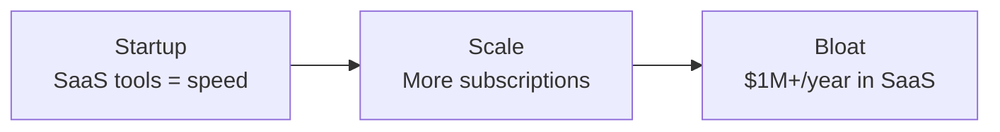

---
defaults:
  transition: slide-left
title: 'The $600K ETL: How We Cancelled a Contract by Building Less'
mdc: true
drawings:
  persist: true
---

# How We Deleted $600K in Software Costs

## And What We Learned Along the Way{.opacity-70}

<div class="mt-5">
<span class="opacity-70">by Ryan Clements, Owner of </span><span class="accent">Byte Bot</span>
</div>

---
layout: center
---

# A business with a deadline doesn't care about your architecture... <span v-click>It only cares that you deliver lasting results.</span>

---
layout: center
---

# Goals

<div>

<v-clicks>

📖 Share a <span class="clip">war story</span> about replacing a $600K/year vendor

🎯 Learn how to <span class="clip">hyperfocus</span> on driving tangible results

📝 Learn <span class="clip">effective</span> technical design and project management techniques

🤝 Learn how to <span class="clip">manage</span> disincentivized vendors

🛠️ Learn practical <span class="clip">design principles</span> for ETL pipelines

🧠 Learn how to <span class="clip">leverage</span> constraints for better outcomes

</v-clicks>

</div>

---
layout: image-right
image: headshot.jpg
---

# Who am I?

<div>RC Clements, Owner of <span class="accent">Byte Bot</span></div>

<v-clicks>

<span class="muted">a full-stack agency that establishes best practices in teams through staff augmentation and coaching</span>

<div class="flex gap-2 mt-10">
  
  
  
  
  
  
  
  
</div>

</v-clicks>

<div class="flex flex-col gap-2 mt-10">
<div>🌐 bytebot.io</div>
<div>📧 info@bytebot.io</div>
<div>🐤 @RyanClementsHax</div>
<div>📥 bytebot.beehiiv.com/subscribe</div>
</div>

---
layout: center
---

TODO: picture of raising hands

<!--
- "Raise your hand if you've ever paid for a gym membership you didn't use."
- "Now keep your hand up if you've ever seen a company pay $50,000 a month for software features they never touched."
-->

---
layout: center
---

# The Client's Origin Story

<div>

<v-clicks>

🏢 Scrappy start

🚀 Launched fast with off the shelf tools

⚡ Getting rated as a loan servicer was **existential**

</v-clicks>

</div>

<!--
- Commercial loan servicer that started scrappy using off-the-shelf SaaS tools
- Getting rated quickly was existential for them - their viability as a business depended on it
- They made the right decision at the time. SaaS tools got them to market fast without building infrastructure
- Emphasize: this was the RIGHT call at the time. No regrets.
-->

---
layout: center
---

# Startup → Scale → Bloat



<!--
Now they've had several years of stable growth, they're dealing with bloat
-->

---
layout: center
---

# The <span class="text-green-500">$1M</span> Problem

<div>

<v-clicks>

💸 **$1M+/year** in subscriptions to just one vendor

📊 Using maybe **20%** of features

🤷‍♂️ Sorta worked

🔒 Locked into contracts

🤔 Major opportunity cost

</v-clicks>

</div>

<!--
- As they scaled, subscriptions ballooned to over $1M/year
- They were using maybe 20% of the features they were paying for
- The tools didn't give them the data analysis they actually needed
- Classic enterprise trap: locked into contracts, paying for optionality they never exercise
-->

---
layout: center
clicks: 11
---

# The Specific Pain Point

<div class="flex items-center justify-center gap-3 mt-10 text-lg relative">

<div v-click="1" class="border border-blue-500/50 rounded-lg px-3 py-2 bg-blue-900/40 text-center w-32 h-14 flex items-center justify-center">
<div class="font-bold text-sm">Servicer</div>
</div>

<div v-click="3" class="text-xl w-8 text-center">→</div>

<div v-click="3" class="border border-red-500/50 rounded-xl p-3 bg-red-900/10">
<div class="text-xs uppercase tracking-wider text-red-400 text-center mb-2">SaaS Tool</div>
<div class="flex items-center gap-3">
<div class="border border-blue-500/50 rounded-lg px-3 py-2 bg-blue-900/40 text-center w-32 h-14 flex items-center justify-center">
<div class="font-bold text-sm">Servicer Acct</div>
</div>
<div class="text-sm opacity-50 w-8 text-center">→</div>
<div class="relative">
<div class="border border-purple-500/50 rounded-lg px-3 py-2 bg-purple-900/40 text-center w-32 h-14 flex flex-col items-center justify-center">
<div class="font-bold text-sm">Parent Co Acct</div>
</div>
</div>
</div>
</div>

<div v-click="3" class="text-xl w-8 text-center">→</div>

<div v-click="2" class="border border-purple-500/50 rounded-lg px-3 py-2 bg-purple-900/40 text-center w-32 h-14 flex items-center justify-center">
<div class="font-bold text-sm">DCH Parent Co</div>
</div>

<div
  v-click="[4, 8]" v-motion
  :initial="{ x: -288 }"
  :enter="{ x: -288 }"
  :click-5="{ x: -96 }"
  :click-6="{ x: 96 }"
  :click-7="{ x: 288 }"
  :leave="{ x: 288 }"
  class="absolute -bottom-8 left-0 right-0 flex justify-center"
><span class="text-2xl">📜</span><span class="text-2xl -ml-3">📜</span><span class="text-2xl -ml-3">📜</span></div>

<div
  v-click="8" v-motion
  :initial="{ x: 288 }"
  :enter="{ x: 288 }"
  :click-9="{ x: 96 }"
  :click-10="{ x: -96 }"
  :click-11="{ x: -288 }"
  class="absolute -bottom-8 left-0 right-0 flex justify-center"
><span class="text-xl">✅</span><span class="text-xl -ml-1">✅</span><span class="text-xl -ml-1">❌</span></div>

</div>

---
layout: center
---

# The Insight

<div v-click class="text-2xl mt-5">

This workflow didn't <span class="clip">need</span> to live in an external tool.

</div>

<div v-click class="text-2xl mt-3">

The parent company <span class="clip">developed an internal platform</span> since the servicer was founded.

</div>

<div v-click class="text-2xl mt-3">

It could be replicated <span class="clip">in-house</span>.

</div>

---
layout: center
clicks: 9
---

# The Vision

<div class="flex items-center justify-center gap-3 mt-10 text-lg relative">

<div class="border border-blue-500/50 rounded-lg px-3 py-2 bg-blue-900/40 text-center w-32 h-14 flex items-center justify-center">
<div class="font-bold text-sm">Servicer</div>
</div>

<div class="text-xl w-8 text-center">→</div>

<div class="border border-red-500/50 rounded-xl p-3 bg-red-900/10">
<div class="text-xs uppercase tracking-wider text-red-400 text-center mb-2">SaaS Tool</div>
<div class="flex items-center justify-center">
<div class="border border-blue-500/50 rounded-lg px-3 py-2 bg-blue-900/40 text-center w-32 h-14 flex items-center justify-center">
<div class="font-bold text-sm">Servicer Acct</div>
</div>
</div>
</div>

<div class="text-xl w-8 text-center">→</div>

<div class="border border-purple-500/50 rounded-xl p-3 bg-purple-800/10">
<div class="text-xs uppercase tracking-wider text-purple-400 text-center mb-2">Internal Platform</div>
<div class="flex items-center justify-center">
<div class="border border-purple-500/50 rounded-lg px-3 py-2 bg-purple-900/40 text-center w-32 h-14 flex items-center justify-center">
<div class="font-bold text-sm">Parent Application</div>
</div>
</div>
</div>

<div class="text-xl w-8 text-center">→</div>

<div class="border border-purple-500/50 rounded-lg px-3 py-2 bg-purple-900/40 text-center w-32 h-14 flex items-center justify-center">
<div class="font-bold text-sm">DCH Parent Co</div>
</div>

<div
  v-click="[1, 5]" v-motion
  :initial="{ x: -312.5 }"
  :enter="{ x: -312.5 }"
  :click-2="{ x: -109 }"
  :click-3="{ x: 115 }"
  :click-4="{ x: 315 }"
  :leave="{ x: 315 }"
  class="absolute -bottom-10 left-0 right-0 flex justify-center"
><span class="text-2xl">📜</span><span class="text-2xl -ml-3">📜</span><span class="text-2xl -ml-3">📜</span></div>

<div
  v-click="5" v-motion
  :initial="{ x: 315 }"
  :enter="{ x: 315 }"
  :click-6="{ x: 115 }"
  :click-7="{ x: -109 }"
  :click-8="{ x: -312.5 }"
  class="absolute -bottom-10 left-0 right-0 flex justify-center"
><span class="text-xl">✅</span><span class="text-xl -ml-1">✅</span><span class="text-xl -ml-1">❌</span></div>

</div>

<div v-click="9" class="mt-14 text-xl text-center">

Same workflow, <span class="clip">replicated in-house</span> on the internal platform.

</div>

---
layout: center
---

# The Deadline

<h2 v-click class="!text-7xl mt-8">

4 months

</h2>

<div class="mt-9 text-3xl">
<span v-click>Starting now</span>
<span v-click>🫡</span>
</div>

<!--
- Enterprise contracts don't forgive missed deadlines
- We had 4 months to ship or eat the cost of another full year on the contract
- This wasn't a "nice to have" - it was a business imperative with a hard stop
- Let the "four months" land. Pause for effect.
-->

---
layout: center
---

# Let's Begin

---
layout: center
---

# Step 1: Define Before You Build

---
layout: center
clicks: 5
---

# The ABDiff Framework

<div class="flex items-center justify-center gap-8 mt-16">

<div v-click="1" v-motion :initial="{ opacity: 0, x: -40 }" :enter="{ opacity: 1, x: 0 }">
<div class="border border-blue-500/50 rounded-xl px-10 py-8 bg-blue-900/30 text-center w-48">
<div class="text-3xl font-bold text-blue-400">A</div>
<div class="text-sm opacity-70 mt-2">Current State</div>
</div>
</div>

<div class="flex flex-col items-center mx-4 relative z-20">
<div v-click="3" v-motion :initial="{ opacity: 0 }" :enter="{ opacity: 1 }">
<svg class="w-40 h-6" viewBox="0 0 160 24"><line x1="0" y1="12" x2="148" y2="12" stroke="#f59e0b" stroke-opacity="0.7" stroke-width="2.5" /><polygon points="148,6 160,12 148,18" fill="#f59e0b" fill-opacity="0.7" /></svg>
</div>
<div v-click="3" v-motion :initial="{ opacity: 0 }" :enter="{ opacity: 1 }" class="absolute top-full mt-2 text-sm font-bold text-amber-400 whitespace-nowrap">The Diff</div>
<div v-click="4" class="absolute -inset-x-16 -inset-y-10 z-30">
<svg class="w-full h-full" viewBox="0 0 200 70" fill="none"><ellipse cx="100" cy="35" rx="97" ry="33" stroke="#f59e0b" stroke-width="2.5" stroke-dasharray="520" stroke-dashoffset="520" class="animate-circle" /></svg>
</div>
<div v-click="4" v-motion :initial="{ opacity: 0, y: 10 }" :enter="{ opacity: 1, y: 0, transition: { delay: 600 } }" class="absolute -bottom-24 whitespace-nowrap text-xl font-bold text-amber-400 z-30">
This is what you ship
</div>
</div>

<div v-click="2" v-motion :initial="{ opacity: 0, x: 40 }" :enter="{ opacity: 1, x: 0 }">
<div class="border border-green-500/50 rounded-xl px-10 py-8 bg-green-900/30 text-center w-48">
<div class="text-3xl font-bold text-green-400">B</div>
<div class="text-sm opacity-70 mt-2">Target State</div>
</div>
</div>

</div>

<div v-click="5" class="mt-20 opacity-40 text-sm text-center">

bytebot.io/blog/stop-assuming-alignment-start-proving-it

</div>

---
layout: center
clicks: 10
---

# Point A - Current State

<div class="relative">

<!-- The core diagram -->
<div v-click="1" class="flex items-center justify-center gap-3 text-lg relative z-10">

<div class="border border-blue-500/50 rounded-lg px-3 py-2 bg-blue-900/40 text-center w-32 h-14 flex items-center justify-center">
<div class="font-bold text-sm">Servicer</div>
</div>

<div class="text-xl w-8 text-center">→</div>

<div class="border border-red-500/50 rounded-xl p-3 bg-red-900/10">
<div class="text-xs uppercase tracking-wider text-red-400 text-center mb-2">SaaS Tool</div>
<div class="flex items-center gap-3">
<div class="border border-blue-500/50 rounded-lg px-3 py-2 bg-blue-900/40 text-center w-32 h-14 flex items-center justify-center">
<div class="font-bold text-sm">Servicer Acct</div>
</div>
<div class="text-sm opacity-50 w-8 text-center">→</div>
<div class="border border-purple-500/50 rounded-lg px-3 py-2 bg-purple-900/40 text-center w-32 h-14 flex items-center justify-center">
<div class="font-bold text-sm">Parent Co Acct</div>
</div>
</div>
</div>

<div class="text-xl w-8 text-center">→</div>

<div class="border border-purple-500/50 rounded-lg px-3 py-2 bg-purple-900/40 text-center w-32 h-14 flex items-center justify-center">
<div class="font-bold text-sm">DCH Parent Co</div>
</div>

</div>

<div v-click="[1, 2]" class="mt-4 text-sm opacity-50 text-center">
📜 Documents flow right &nbsp;→&nbsp; ✅❌ Decisions flow left
</div>

<!-- 👥 Stakeholders: labels appear below each entity -->
<div v-click="2" class="absolute left-1/2 -translate-x-1/2 top-0 w-full flex items-center justify-center gap-3 text-lg" style="pointer-events:none">
<div class="w-32 text-center"><div class="mt-16 text-xs text-cyan-400 font-bold flex items-center" v-motion :initial="{ opacity: 0, y: -8 }" :enter="{ opacity: 1, y: 0 }"><span class="-mt-0.75 mr-0.5">👥</span> Asset Managers</div></div>
<div class="w-30"></div>
<div class="px-3 py-3">
<div class="mb-2">&nbsp;</div>
<div class="flex items-center gap-3">
<div class="w-40 text-center"><div class="mt-16 text-xs text-cyan-400 font-bold flex items-center" v-motion :initial="{ opacity: 0, y: -8 }" :enter="{ opacity: 1, y: 0 }"><span class="-mt-0.75 mr-0.5">👥</span> Vendor Account Mgr</div></div>
</div>
</div>
<div class="w-24"></div>
<div class="w-32 text-center"><div class="mt-16 text-xs text-cyan-400 font-bold flex items-center" v-motion :initial="{ opacity: 0, y: -8 }" :enter="{ opacity: 1, y: 0 }"><span class="-mt-0.75 mr-0.5">👥</span> Leadership</div></div>
</div>

<!-- 💰 Incentives: conflicting motivation arrows -->
<div v-click="3" class="absolute left-1/2 -translate-x-1/2 top-0 w-full flex items-center justify-between gap-3 text-lg mt-28 pr-3" style="pointer-events:none">
<div class="text-center"><div class="text-xs text-gray-400 font-bold" v-motion :initial="{ opacity: 0 }" :enter="{ opacity: 1 }">💰 Wants nothing to change</div></div>
<div class="text-center -ml-12 mt-5"><div class="text-xs text-amber-400 font-bold" v-motion :initial="{ opacity: 0 }" :enter="{ opacity: 1 }">💰 Wants to keep $$</div></div>
<div class="text-center"><div class="text-xs text-green-400 font-bold" v-motion :initial="{ opacity: 0 }" :enter="{ opacity: 1 }">💰 Wants to save $$</div></div>
</div>

<!-- ⏰ Timeline: deadline banner above diagram -->
<div v-click="4" v-motion :initial="{ opacity: 0, y: 8 }" :enter="{ opacity: 1, y: 0 }" class="absolute -top-10 right-0 z-20">
<div class="border border-red-500/60 rounded-full px-5 py-1 bg-red-900/30 text-xs font-bold text-red-400 whitespace-nowrap">⏰ Hard deadline: 4 months - no extensions</div>
</div>

<!-- 📋 Business process (left) & ⚠️ Non-functional requirements (right) -->
<div class="flex justify-between mt-4">
<div v-click="5" v-motion :initial="{ opacity: 0, x: -10 }" :enter="{ opacity: 1, x: 0 }" class="flex gap-2" style="pointer-events:none">
<span class="text-[10px] text-orange-400 bg-orange-900/30 border border-orange-500/30 rounded px-1.5 py-0.5">📋 Data flow</span>
<span class="text-[10px] text-orange-400 bg-orange-900/30 border border-orange-500/30 rounded px-1.5 py-0.5">📋 Decision makers</span>
<span class="text-[10px] text-orange-400 bg-orange-900/30 border border-orange-500/30 rounded px-1.5 py-0.5">📋 Edge cases</span>
</div>
<div v-click="6" v-motion :initial="{ opacity: 0, x: 10 }" :enter="{ opacity: 1, x: 0 }" class="flex gap-2" style="pointer-events:none">
<span class="text-[10px] text-yellow-400 bg-yellow-900/30 border border-yellow-500/30 rounded px-1.5 py-0.5">⚠️ Scalability</span>
<span class="text-[10px] text-yellow-400 bg-yellow-900/30 border border-yellow-500/30 rounded px-1.5 py-0.5">⚠️ Latency</span>
<span class="text-[10px] text-yellow-400 bg-yellow-900/30 border border-yellow-500/30 rounded px-1.5 py-0.5">⚠️ Cost</span>
</div>
</div>

<!-- 💥 Failure modes: explosion markers at connection points -->
<div v-click="7" class="absolute left-1/2 -translate-x-1/2 -top-1 w-full flex items-center justify-center gap-3 text-lg" style="pointer-events:none">
<div class="w-27"></div>
<div class="w-8 relative"><span v-motion :initial="{ opacity: 0, scale: 0.5 }" :enter="{ opacity: 1, scale: 1 }" class="absolute -top-1 left-1/2 -translate-x-1/2 text-base">💥</span></div>
<div class="px-3 py-3">
<div class="mb-2">&nbsp;</div>
<div class="flex items-center gap-3">
<div class="w-32"></div>
<div class="w-8 relative"><span v-motion :initial="{ opacity: 0, scale: 0.5 }" :enter="{ opacity: 1, scale: 1 }" class="absolute -top-1 left-1/2 -translate-x-1/2 text-base">💥</span></div>
<div class="w-32"></div>
</div>
</div>
<div class="w-8 relative"><span v-motion :initial="{ opacity: 0, scale: 0.5 }" :enter="{ opacity: 1, scale: 1 }" class="absolute -top-1 left-1/2 -translate-x-1/2 text-base">💥</span></div>
<div class="w-32"></div>
</div>

</div>

<!-- 🏢 Corporate dynamics: positioned below diagram via slide-level absolute -->
<div v-click="8" v-motion :initial="{ opacity: 0, y: -8 }" :enter="{ opacity: 1, y: 0 }" class="absolute bottom-28 left-0 right-0 flex justify-center gap-4" style="pointer-events:none">
<span class="text-[10px] text-pink-400 bg-pink-900/30 border border-pink-500/30 rounded px-1.5 py-0.5">🏢 Momentum</span>
<span class="text-[10px] text-pink-400 bg-pink-900/30 border border-pink-500/30 rounded px-1.5 py-0.5">🏢 Decision making</span>
<span class="text-[10px] text-pink-400 bg-pink-900/30 border border-pink-500/30 rounded px-1.5 py-0.5">🏢 Resourcing</span>
</div>

<!-- Summary callout: fade between messages in the same spot -->
<div v-click="[9, 10]" v-motion :initial="{ opacity: 0 }" :enter="{ opacity: 1 }" :leave="{ opacity: 0 }" class="absolute bottom-14 left-0 right-0 flex justify-center" style="pointer-events:none">
<div class="inline-block border border-amber-500/50 rounded-lg px-6 py-2 bg-amber-900/20">
<span class="text-amber-400 font-bold text-lg whitespace-nowrap">Understanding the tech ≠ understanding Point A</span>
</div>
</div>
<div v-click="10" v-motion :initial="{ opacity: 0 }" :enter="{ opacity: 1 }" class="absolute bottom-14 left-0 right-0 flex justify-center" style="pointer-events:none">
<div class="inline-block border border-amber-500/50 rounded-lg px-6 py-2 bg-amber-900/20">
<span class="text-amber-400 font-bold text-lg whitespace-nowrap">If no one's listening to your ideas, this is probably why.</span>
</div>
</div>

---
layout: center
---

# There are known knowns...

<div v-click class="mt-5 text-2xl">

...and then there are the APIs you've never integrated with.

</div>

---
layout: center
---

# Major Risks

<div class="text-2xl">

<v-clicks>

1. Poorly documented APIs

2. A vendor with zero incentive to help

3. Data issues

</v-clicks>

</div>

---
layout: center
---

# The Data Problem

<div>

<v-clicks>

🔀 Messy data flows

🆔 No clean IDs

🎨 "Creative" data quality

</v-clicks>

</div>

<div v-click class="mt-8 text-xl">

> "Don't trust. Verify. Then verify again."

</div>

<!--
- Before even touching code, we discovered the existing workflow was a mess of data flowing between two accounts
- No clean unique identifiers in their system
- Data quality was... "creative" - tell a short anecdote if time allows
- We couldn't trust what they told us about the data - we had to verify everything ourselves
-->

---
layout: center
clicks: 1
---

# Point B - Target State

<div class="relative">

<div class="flex items-center justify-center gap-3 mt-10 text-lg relative">

<div class="border border-blue-500/50 rounded-lg px-3 py-2 bg-blue-900/40 text-center w-32 h-14 flex items-center justify-center">
<div class="font-bold text-sm">Servicer</div>
</div>

<div class="text-xl w-8 text-center">→</div>

<div class="border border-red-500/50 rounded-xl p-3 bg-red-900/10">
<div class="text-xs uppercase tracking-wider text-red-400 text-center mb-2">SaaS Tool</div>
<div class="flex items-center justify-center">
<div class="border border-blue-500/50 rounded-lg px-3 py-2 bg-blue-900/40 text-center w-32 h-14 flex items-center justify-center">
<div class="font-bold text-sm">Servicer Acct</div>
</div>
</div>
</div>

<div class="text-xl w-8 text-center">→</div>

<div class="border border-green-500/50 rounded-xl p-3 bg-green-800/10">
<div class="text-xs uppercase tracking-wider text-green-400 text-center mb-2">Internal Platform</div>
<div class="flex items-center justify-center">
<div class="border border-purple-500/50 rounded-lg px-3 py-2 bg-purple-900/40 text-center w-32 h-14 flex items-center justify-center">
<div class="font-bold text-sm">Parent Co Acct</div>
</div>
</div>
</div>

<div class="text-xl w-8 text-center">→</div>

<div class="border border-purple-500/50 rounded-lg px-3 py-2 bg-purple-900/40 text-center w-32 h-14 flex items-center justify-center">
<div class="font-bold text-sm">DCH Parent Co</div>
</div>

</div>

<div class="mt-6 text-sm opacity-50 text-center">
📜 Documents flow right &nbsp;→&nbsp; ✅❌ Decisions flow left
</div>

<div v-click="1" v-motion :initial="{ opacity: 0, scale: 0.3 }" :enter="{ opacity: 1, scale: 1 }" class="absolute inset-0 flex items-center justify-center z-50">
<span class="text-[12rem] drop-shadow-[0_0_40px_rgba(239,68,68,0.5)]">❌</span>
</div>

</div>

<!--
- SETUP THE TRAP: Ask "So... what's our Point B?"
- Someone will say "that target architecture" or list deliverables.
- Say: "That's what we were TOLD. But is that really Point B?"
- Pause. Move to the next slide.
-->

---
layout: center
---

# Point B is NOT...

<div>

<v-clicks>

🔧 A microservice

🏗️ An architecture

📋 A policy or process

📦 A list of deliverables

</v-clicks>

</div>

<div v-click class="mt-8 text-2xl">

These are <span class="clip">outputs</span>, not <span class="clip">outcomes</span>.

</div>

<!--
- Walk through the list: these are the things people typically hand you as "the goal."
- "Build an ETL pipeline" - that's an implementation detail.
- "Move to microservices" - that's an architecture.
- "Follow this runbook" - that's a process.
- Let the audience nod along - they've all been handed these as Point B.
- Then hit them: "These are outputs, not outcomes."
- Outputs are negotiable. Outcomes are not.
-->

---
layout: center
---

# Point B IS...

<div>

<v-clicks>

🎯 The **why** behind the work

💥 The **impact** on the business

🏆 The **outcome** that matters

</v-clicks>

</div>

<div v-click class="mt-8 text-xl">

If no one gave you the <span class="clip">why</span>, go find it.

</div>

<!--
- Shift the energy: "So what IS Point B?"
- It's the why - the reason the project exists.
- It's the impact - what changes for the business when you're done.
- It's the outcome - not what you build, but what you achieve.
- Closing: "If no one gave you the why, go find it." It changes every decision you make.
-->

---
layout: center
clicks: 1
---

# Point B

<div class="flex items-center justify-center gap-3 mt-10 text-lg relative">

<div class="border border-blue-500/50 rounded-lg px-3 py-2 bg-blue-900/40 text-center w-32 h-14 flex items-center justify-center">
<div class="font-bold text-sm">Servicer</div>
</div>

<div class="text-xl w-8 text-center">→</div>

<div class="border border-red-500/50 rounded-xl p-3 bg-red-900/10">
<div class="text-xs uppercase tracking-wider text-red-400 text-center mb-2">SaaS Tool</div>
<div class="flex items-center gap-3">
<div class="border border-blue-500/50 rounded-lg px-3 py-2 bg-blue-900/40 text-center w-32 h-14 flex items-center justify-center">
<div class="font-bold text-sm">Servicer Acct</div>
</div>
<div class="text-sm opacity-50 w-8 text-center">→</div>
<div class="relative">
<div class="border border-purple-500/50 rounded-lg px-3 py-2 bg-purple-900/40 text-center w-32 h-14 flex items-center justify-center">
<VSwitch>
<template #0><div class="font-bold text-sm">Parent Co Acct</div></template>
<template #1><div class="text-lg font-bold text-green-400">$50K/mo</div></template>
</VSwitch>
</div>
</div>
</div>
</div>

<div class="text-xl w-8 text-center">→</div>

<div class="border border-purple-500/50 rounded-lg px-3 py-2 bg-purple-900/40 text-center w-32 h-14 flex items-center justify-center">
<div class="font-bold text-sm">DCH Parent Co</div>
</div>

</div>

---
layout: center
---

# Point B

<h2 class="!text-4xl mt-8">

<span class="clip">Save $50k/mo. <span v-click>Minimal disruption.</span> <span v-click>Don't be late.</span></span>

</h2>

<div v-click class="mt-8 text-xl opacity-70">

That's it. That's point B.

</div>

<!--
- Show the familiar architecture diagram - they've seen this before.
- Click to reveal: $50K/mo sitting in that Parent Co account box.
- That's the real Point B. Cancel that. Save that money. Everything else is negotiable.
-->

---
layout: center
---

# The Diff = The Backlog

<div>

<v-clicks>

🧭 **Strategy** — which approach and why

🏗️ **Architecture** — systems, boundaries, contracts

📋 **Subtasks** — discrete units with clear owners

🔗 **Integrations** — every touchpoint between systems

🚧 **Migrations** — data, schemas, feature flags

🧪 **Testing** — what to validate and how

🚀 **Rollout** — deployment steps, rollback plans

</v-clicks>

</div>

<!--
- The diff should be exhaustive - nothing left implied, nothing assumed
- Each question we asked during the diff became a backlog item or revealed hidden work
- They even forgot entire integration points existed - deployments they assumed would "just work"
- Without this exercise, original estimates would have been months off
- The validation: if completing every item doesn't get you from A to B, something was defined wrong
- Key point: "Break it into pieces your team can execute. Make ownership clear. Make outcomes testable."
-->

---
layout: center
---

# Key Decisions

<div>

<v-clicks>

🛠️ **Simple tools**

🎯 **Cancel the contract** - nothing else

📌 **Sources of truth**

🔁 **Idempotency**

📝 **Logging over metrics**

</v-clicks>

</div>

<div v-click class="mt-8 text-xl">

> "Don't try to solve every problem. We stayed focused."

</div>

<!--
- Simple tools: Low-volume ETL meant no need for Kafka, Airflow, etc. Don't over-engineer.
- Cancel the contract: The goal was to cancel the contract, not fix bugs or improve the existing system. Don't add risk.
- Sources of truth: Define which system owns which data element. Handle sync failures gracefully.
- Idempotency: At-least-once delivery semantics. Handle duplicates gracefully.
- Logging over metrics: The team hadn't invested in metrics infrastructure yet. Meet them where they are.
-->

---
layout: center
---

# Step 2: Managing the Disincentivized Vendor

---
layout: center
---

# The Communication Breakthrough

TODO: visual showing emails going into a void vs. a Teams channel lighting up - the "before and after" of communication

<div>

<v-clicks>

📧 → 🕳️

💬 → ✅

</v-clicks>

</div>

<!--
- Tell the story: Emails were going into a black hole. No responses, no progress.
- Then we realized they used Microsoft Teams - just like our client!
- Set up a shared Teams channel + weekly sync meeting
- Communication problems: solved overnight
- The point: sometimes the breakthrough isn't technical, it's finding the right communication channel
-->

---
layout: center
---

# The "Ball in Their Court" Strategy

<div class="text-xl mb-5">

> "They had zero incentive to meet our deadline. So we made sure they were never waiting on us."

</div>

<div>

<v-clicks>

⚡ Respond fast

🔮 Pre-answer questions

📝 Document everything

🔦 Make delays visible

</v-clicks>

</div>

<!--
- Respond to their requests within hours, not days - show urgency even if they don't
- Pre-answer questions they hadn't asked yet - anticipate and remove blockers before they arise
- Document everything in the shared channel - build the paper trail
- Make it obvious when delays were on their side
- Result: when escalation conversations happened, the paper trail was clear and we were never the bottleneck
-->

---
layout: center
---

# Security - Early

<div>

<v-clicks>

🔒 **Day one**

🔑 Access, SFTP, credentials

🏃 **Hit the ground running**

</v-clicks>

</div>

<!--
- Got the security team involved from day one - don't let this become a blocker later
- Access provisioning, SFTP setup, credential exchange - all the things that take weeks if you start late
- By the time engineering resources were available, we could hit the ground running
- Key point: security setup is a known long-lead-time item. Start it immediately.
-->

---
layout: center
---

# Step 3: Building for Reality

---
layout: center
---

# "Their API took 15 minutes to respond."

<div v-click class="mt-5 text-xl opacity-70">

I wish I was joking.

</div>

<!--
Pause for audience reaction. Let the absurdity sink in.
-->

---
layout: center
---

# Local DX Investment

```text
Production:     API call → 15 min → response → process
Development:    Local file → instant → cached response → process
```

<div v-click class="mt-5 text-xl">

✨ **Still used today** - not just for dev, but for production debugging

</div>

<!--
- The 15-minute API forced a decision: invest in local DX or lose weeks to slow iteration
- Read test data from local files, cache API responses locally
- Same code path, switchable data source - production code and dev code are the same
- This investment is STILL used today - not just for development, but for production debugging
- Industry validation: API mocking is now considered essential. Tools like MSW, Mockoon, and WireMock exist for exactly this problem.
-->

---
layout: center
---

# "Get the bones working before you add the muscle."

TODO: consider a visual showing skeleton system -> integrated system timeline progression

<div>

<v-clicks>

🦴 Skeleton first

🔗 Integrate early

👀 Demo early

🐛 Find issues early

</v-clicks>

</div>

<!--
- Get a skeleton integration into the test environment ASAP - even if nothing works end-to-end yet
- Integrated with (almost) all systems before features were complete
- Others could demo and test early - stakeholders saw real progress, not just promises
- Surfaced integration issues before they became blockers
- Key point: early integration catches the problems that unit tests can't
-->

---
layout: center
---

# Design Principles That Saved Us

<div>

<v-clicks>

🔍 **Data quality skepticism**

🔄 **Swappable replacement**

📌 **Clear source of truth**

👁️ **Observability first**

🔁 **Idempotent operations**

</v-clicks>

</div>

<!--
- Data quality skepticism: validate everything; trust nothing from the third party
- Swappable replacement: match existing behavior exactly so rollback is easy - don't "improve" things during the migration
- Clear source of truth: define which system owns which data element
- Observability first: extensive logging, alerts on failures - you need to see what's happening in production
- Idempotent operations: handle duplicates gracefully - at-least-once delivery means you WILL see duplicates
-->

---
layout: center
---

# Step 4: The Data Reality Check

---
layout: center
---

# "We were 'told' many things about the data."

<div v-click class="mt-5 text-2xl">

"Then we actually looked at it."

</div>

<!--
- Check live data regularly, not just at milestones - surprises hide in production data
- Edge cases nobody considered? Present.
- Things everyone swore were edge cases? Not actually present.
- Assumptions from stakeholders do NOT equal reality in the database
- Drive home: the only way to know your data is to look at it yourself, repeatedly
-->

---
layout: center
---

# The Launch

<div>

<v-clicks>

🚀 Shipped **2 months early**

🐞 Early production usage = early bug discovery

👩‍💻 Users could test real workflows while we iterated

</v-clicks>

</div>

<div v-click class="mt-10 text-2xl">

"And then... the phone rang."

</div>

<!--
Dramatic transition - pause here, let it build.
-->

---
layout: center
---

# <span class="tag">Part 4:</span> The Plot Twist

## The 380K Document Problem

---
layout: center
---

# "Great news, we love the new system!"

<div v-click class="mt-5 text-2xl">

"Oh, by the way... we need our documents from the old system."

</div>

<div>

<v-clicks>

📄 **380,000 documents** in the legacy system

🚫 No easy export

🚫 No API for bulk retrieval

😬 The disincentivized vendor's help was required. **Again.**

</v-clicks>

</div>

---
layout: center
---

# The Mapping Problem

TODO: diagram showing the mapping challenge (old system entities with no clean IDs -> fuzzy matching via addresses, geo-coordinates, property IDs -> new system entities)

<div v-click class="mt-5 text-xl">

No clean IDs. Fuzzy matching required.

</div>

<div v-click class="mt-5 opacity-70">

**The save:** ABDiff documentation let us pull in another engineer. The scope was already clear.

</div>

<!--
- Documents were attached to entities in the old system, but there were no intelligible IDs that mapped to our systems
- Had to build a separate mapping project using addresses, geo-coordinates, random property IDs, and fuzzy matching
- The ABDiff documentation saved us here: we could pull an engineer from another project and they could ramp up quickly because the scope was already clear
-->

---
layout: center
---

# The Naive Approach

<div>

<v-clicks>

🐌 Single-threaded upload

⏱️ Estimated time: **1 week**

😬 We didn't have 1 week.

</v-clicks>

</div>

---
layout: center
---

# The Performance Journey

TODO: visual showing performance progression (1 week naive -> rate limits with multi-threading -> hours with S3-to-S3 copy)

<div>

<v-clicks>

<div class="text-2xl mb-5">

**Multi-threading** → rate limits

</div>

<div class="text-2xl mb-5">

**S3-to-S3 copy** → **hours instead of a week** ⚡

</div>

</v-clicks>

</div>

<!--
- First attempt: multi-threading. Hit rate limits immediately - document service wasn't built for this scale.
- The breakthrough: "Wait. The documents are already in S3. Our service stores to S3. Why are we downloading and uploading?"
- S3-to-S3 copy brought the full ingest from an estimated week down to hours
- Key insight: this was a one-time ingest. We could cut corners on maintainability because this code would never run again.
-->

---
layout: center
---

# "Ditching maintainability for a one-time script was liberating."

<div>

<v-clicks>

🔁 Full **retryability** - resume from any point

✅ Automatic **verification** - validate what we ingested

🔍 Pierced the veil - checked S3 directly, **bypassed API**

📝 Extensive **logging** for debugging

</v-clicks>

</div>

<div v-click class="mt-5 opacity-70">

"We safely cut tons of corners."

</div>

---
layout: center
---

# The Victory

<div>

<v-clicks>

📄 Documents ingested and verified **1 week early**

✅ Zero hitches

📝 Contract cancelled on schedule

</v-clicks>

</div>

<div v-click class="mt-8">

<h2 class="!text-5xl">

<span class="clip">$600K/year saved</span>

</h2>

</div>

---
layout: center
---

# <span class="tag">Part 5:</span> Takeaways

## What You Can Steal

---
layout: center
---

# The Principles

<div>

<v-clicks>

📐 **Define A and B Before Writing Code** - ABDiff: current state → target state → the diff is your backlog

🎯 **Constraint-Driven Design** - low volume? Simple tools. One-time script? Skip maintainability.

🤝 **Manage Disincentivized Vendors** - ball always in their court, over-communicate, over-document

💻 **Invest in Local DX** - slow APIs? Mock locally. It's for production debugging too.

🔍 **Trust Data You've Seen, Not Data You've Heard About** - verify early, verify often

🦴 **Bare Bones Before Bells and Whistles** - skeleton first, features second

</v-clicks>

</div>

---
layout: center
---

# "The most valuable software we shipped that year wasn't a new feature."

<div v-click class="mt-5 text-2xl">

"It was the ability to **delete an entire system**."

</div>

<div v-click class="mt-8 text-xl opacity-70">

Sometimes engineering excellence isn't about building more. It's about understanding exactly what you need, building exactly that, and having the discipline to stop there.

</div>

---
layout: center
---

# <span class="no-clip">🤔</span> Got questions?

---
layout: image-left
image: linktree-qr.png
backgroundSize: contain
---

# Here's how we can stay in touch

<div class="flex flex-col gap-5 text-2xl mt-5">

<div>🌐 bytebot.io</div>
<div>📧 info@bytebot.io</div>
<div>🐤 @RyanClementsHax</div>
<div>📥 bytebot.beehiiv.com/subscribe</div>

</div>
